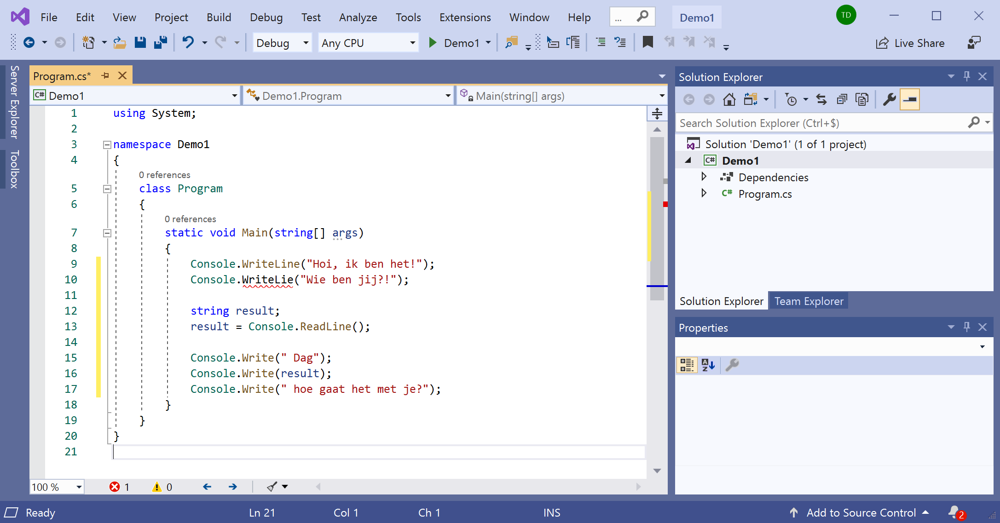
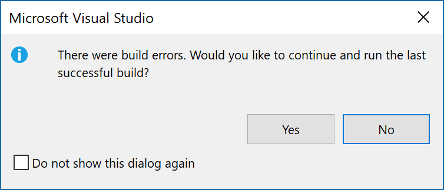
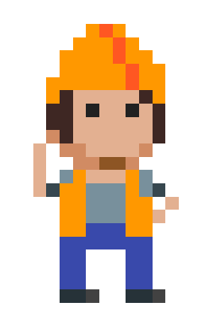

## Fouten oplossen

Je code zal pas compileren indien deze foutloos is geschreven. Herinner je dat computers uiterst dom zijn en dus vereisen dat je code 100% foutloos is qua woordenschat en grammatica.

Zolang er dus fouten in je code staan moet je deze eerst oplossen voor je verder kan. Gelukkig helpt VS je daarmee op 2 manieren:

* Fouten in code worden met een rode squiggly onderlijnt.
* Onderaan zie je in de statusbalk of je fouten hebt.

### Fouten sneller vinden

Uiteraard ga je vaak code hebben die meerdere schermen omvat. Je kan via de error-list snel naar al je fouten gaan. Open deze door op het error-icoontje onderaan te klikken:

Dit zal de "error list" openen (een schermdeel van VS dat we aanraden om altijd open te laten én dus niet weg te klikken):

<!--- {width:70%} --->

In deze list kan je nu op iedere error klikken om ogenblikkelijk naar de correcte lijn te gaan.

Zou je toch willen compileren en je hebt nog fouten dan zal VS je proberen tegen te houden. **Lees nu onmiddellijk wat de voorman hierover te vertellen heeft.**

<!--- {width:70%} --->

<!---NOBOOKSTART--->

<!---NOBOOKEND--->
<!---{aside}--->
<!--- {float:right, width:50%} --->

Opletten aub : Indien je op de groene start knop duwt en bovenstaande waarschuwing krijgt **KLIK DAN NOOIT OP YES EN DUID NOOIT DE CHECKBOX AAN**:

Lees de boodschap eens goed na: wat denk je dat er gebeurt als je op 'yes' duwt? Inderdaad, VS zal de laatste werkende versie uitvoeren en dus niet de code die je nu hebt staan waarin nog fouten staan.
<!---{/aside}--->
<!---NOBOOKSTART--->

<!---NOBOOKEND--->


De voorman verschijnt wanneer er iets beschreven wordt waar véél fouten op gemaakt worden, zelfs bij ervaren programmeurs. Opletten geblazen dus.


### Fouten oplossen

Wanneer je je cursor op een lijn met een fout zet dan zal je soms vooraan een geel error-lampje zien verschijnen:

Je kan hier op klikken en heel vaak krijg je dan ineens een mogelijke oplossing. **Wees steeds kritisch** hierover want VS is niet alwetend en kan niet altijd raden wat je bedoelt. Neem dus het voorstel niet zomaar over zonder goed na te denken of het dat was wat je bedoelde.


Warnings kan je over het algemeen , zeker in het begin, negeren. Bekijk ze gewoon af en toe, wie weet bevatten ze nuttige informatie om je code te verbeteren.


### Meest voorkomende fouten

De meest voorkomende fouten die je als beginnende C# programmeur maakt zijn:

* **Puntkomma** vergeten.
* **Schrijffouten** in je code, bijvoorbeeld ``RaedLine`` i.p.v. ``ReadLine``.
* Geen rekening gehouden met **hoofdletter gevoeligheid van #** ``Readline`` i.p.v. ``ReadLine`` (zie verder).
* Per ongeluk **accolades verwijderd**.
* Code geschreven op plekken waar dat niet mag (je mag momenteel enkel binnen de accolades van ``Main`` schrijven).