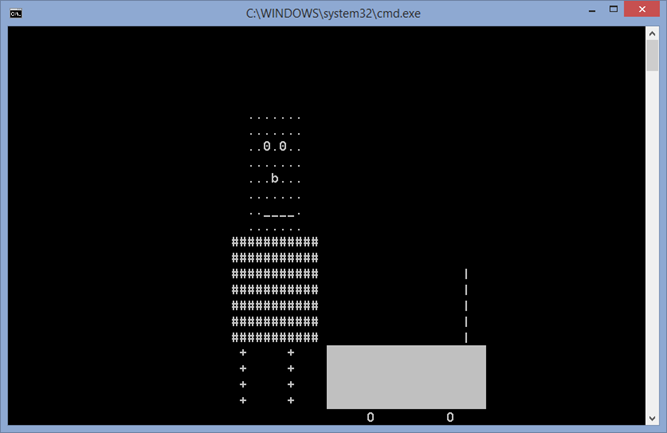

# Methoden gebruiken om een ascii-filmpje te maken

Volgende demonstratie toont de kracht van methoden. We zullen een steeds complexer geheel maken, dat dankzij methoden, nog steeds onderhoudbaar én leesbaar zal blijven. We zullen een bottom-up approach hanteren waarbij we eerst beginnen met de meest basis-functionaliteit die we nodig hebben en zo steeds een schil , in de vorm van een methode, er omheen coderen. 

Ons doel is een method ``SpeelFilm`` te maken die een filmpje, bestaande uit opeen volgende frames en scenes, zal afspelen in de Console.

We zullen een uiterst boeiend filmpje maken waarin een mannetje naar z’n auto wandelt en er vervolgens in wegrijdt.



## Karakter op scherm tekenen
We maken een methode die 1 karakter op het scherm kan plaatsen op een positie naar keuze. Omdat we willen voorkomen dat dit mislukt indien de coördinaten buiten het scherm vallen, zullen we in deze methode eerst controleren of de coördinaten geldig zijn.

```java
static void DrawChar(char drawchar, int posX, int posY)
{
    if (posX >= 0 && posX < Console.WindowWidth)
    {
        if (posY >= 0 && posY < Console.WindowHeight)
        {
            Console.SetCursorPosition(posX, posY);
            Console.Write(drawchar);
        }
    }
}
```
Willen we deze methode gebruiken dan kunnen we bijvoorbeeld in de ``Main`` schrijven: ``DrawChar('@',5,10);``
Dit zal resulteren in het "@"-teken op het scherm op de positie 5, 10 (plaatsen naar rechts, 10 lijnen naar beneden).

## Rechthoek tekenen
Een rechthoek tekenen kan nu heel eenvoudig met behulp van 2 for-lussen.Eén lus om van links naar rechts te gaan. Eén lus om van boven naar onder te gaan.

De methode aanvaardt naast het karakter dat we willen tekenen ook nog :

1. De positie van de linkerbovenhoek van rechthoek op het scherm
2. De lengte en de breedte van de rechthoek

```java
static void DrawRectangle(char drawchar, int posX, int PosY, int width, int height)
{
    for (int i = posX; i < posX + width; i++)
    {
        for (int j = PosY; j < PosY + height; j++)
        {
            DrawChar(drawchar, i, j);
        }
    }
}
```
We kunnen dus deze methode aanroepen als volgt:``DrawRectangle('*',4,6,3,6);``

## Gezicht tekenen
Het hek is van de dam. We kunnen nu allerlei complexere zaken tekenen bestaande uit combinaties van rechthoeken en karakters. Een gezicht kan bijvoorbeeld bestaan uit 1 grote rechthoek voor het gezicht. Met daarin 2 aparte ogen, voorgesteld door het karakter ‘0’ (dus mbv DrawChar) en een neus 'b'. Alsook een mond die bestaat uit een korte rechthoek bestaande uit underscores:

```java
static void DrawFace(int posX, int posY)
{
    DrawRectangle('.', posX, posY, 7, 8);
    DrawChar('0', posX + 2, posY + 2);
    DrawChar('0', posX + 4, posY + 2);
    DrawChar('b', posX + 3, posY + 4);
    DrawRectangle('_', posX + 2, posY + 6, 4, 1);
}
```
De enige extra complexiteit is dat we steeds rekening moeten houden met de locatie van het gezicht (``posx``,``posy``) en de onderlinge posities van de gezichts-onderdelen. We plaatsen dus bijvoorbeeld de mond op 6e lijn ten opzichte van de bovenkant van het gezicht.
Denk er ook aan dat we de volgorde van methode-aanroepen hier relevant is.Indien we de eerste DrawRectangle aanroep helemaal onderaan zouden plaatsen, dan zou deze al de andere gezichts-onderdelen overtekenen.

## Auto tekenen

```java
static void DrawCar(int posX, int posY)
{
    DrawRectangle('█', posX, posY + 5, 20, 4);
    DrawRectangle('|', posX + 17, posY, 1, 5);
    DrawChar('O', posX + 5, posY + 9);
    DrawChar('O', posX + 15, posY + 9);
}
```

## Mannetje tekenen
Een mannetje tekenen bestaat dan uit een gezicht een lijf (rechthoek) en 2 benen (rechthoek). Z’n armen is hij kwijtgeraakt:

```java
static void DrawMan(int posX, int posY)
{
    DrawFace(posX + 4, posY);
    DrawRectangle('+', posX + 3, posY + 14, 1, 5);
    DrawRectangle('+', posX + 9, posY + 14, 1, 5);
    DrawRectangle('#', posX + 2, posY + 8, 11, 7);
}
```
Of een mannetje dat spring?

```java
static void DrawJumpingMan(int posX, int posY)
{
    DrawFace(posX + 4, posY);
    DrawRectangle('+', posX + 3, posY + 14, 1, 5);
    DrawRectangle('+', posX + 9, posY + 15, 5, 1);
    DrawRectangle('#', posX + 2, posY + 8, 11, 7);
}
```
Volgende code zal een animatie afspeelt van een mannetje dat springt en staat afwisselend:

```java
int teller = 0;
while (true)
{
     
    if(teller%2==0)
        DrawMan(4,4);
    else
    {
        DrawJumpingMan(4,4);
    }
    teller++;
}
```
## Man in auto
We kunnen weer een niveau hoge gaan: we combineren onze ``DrawMan`` en ``DrawCar`` methode om zo een mannetje in een auto te krijgen:

```java
static void DrawManInCar(int posX, int posY)
{
    DrawMan(posX + 2, posY);
    DrawCar(posX, posY + 10);
}
```

## Film maken
We kunnen nu een uber-boeiend filmpje maken waarin het mannetje naar de auto loopt en dan er in wegrijdt.We zullen dit stukje top-down benaderen. Eerst maken we een methode ``PlayMovie()`` die frame per frame het filmpje zal afspelen.Afhankelijk van het framenummer zal een andere scene getoond worden (lijnen 6,8):

```java
private static void PlayMovie()
{
    for (int i = 0; i < 60; i++)
    {
        if (i < 35)
            WalkToCarScene(i);
        else if (i >= 35)
            RideAwayScene(i - 35);
 
        System.Threading.Thread.Sleep(100);
        Console.Clear();
    }
}
```
Merk op dat we ``i`` gebruiken als framenummer en zo weten wanneer welke scene moet afgespeeld worden. Voorts geven we het framenummer door naar de scene-methoden voor het geval ze deze nodig hebben om bijvoorbeeld de correcte positie te bepalen:

```java
private static void RideAwayScene(int framenumber)
{
    DrawManInCar(40+framenumber*2,5);
}
 
private static void WalkToCarScene(int framenumber)
{
    if (framenumber % 2 == 0)
    {
        DrawJumpingMan(1 + framenumber, 5);
    }
    else
    {
        DrawMan(1 + framenumber, 5);
    }
 
 
    DrawCar(40, 15);
}
```


