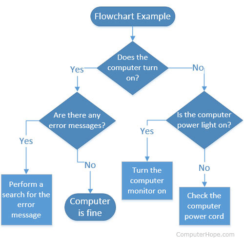


Dit zijn goede oefeningen om te testen of je alle leerstof van de voorbije hoofdstukken goed beheerst. De volgende opgaven waren ook soms effectieve (tussentijdse) vaardigheidsproeven voor dit vak.


*Geschatte tijd om dit te maken: 60 minuten*

# Module 1 Afsluiter

## Opgave

Maak een multitool-applicatie die wanneer deze opstart aan de gebruiker een menu toont. Afhankelijk van de input van de gebruiker zal er vervolgens een ander stuk uitgevoerd worden. De verschillende keuzes zijn (de gebruiker voert een cijfer in!):

* **Menuitem 1 - Rekenmachine**. Indien dit gekozen wordt zal het programma eerst 2 getallen aan de gebruiker vragen, gevolgd door een keuzemenu waarop de gebruiker een operator kan kiezen (``+,-,*,/,%``). Het programma toont dan het resultaat indien de operator op de twee ingevoerde getallen wordt uitgevoerd. Wanneer de uitkomst negatief is dan zal de uitkomst in het rood worden getoond. 
* **Menuitem 2 - Password tester:** Vraag aan de gebruiker z'n paswoord. Indien dit gelijk is aan "TrumpSux" zal er een groene tekst "Toegelaten" verschijnen. Zoniet een rode "Verboden" tekst.
* **Menuitem 3 -  Recyclage:** Kies eender welk programma dat je in dit of vorig hoofdstuk hebt gemaakt waarin je input aan de gebruiker ook verwerkt. Plaats dit programma achter dit menuitem
* **Menuitem 4  - Computersolver :** Implementeer volgende flowchart . 
Een ruit geeft aan dat je een ja/nee vraag aan de gebruiker stelt (gebruik de tekst dus in de ruit). Een rechthoek (ook die met ronde hoeken) is tekst die je aan de gebruiker toont.