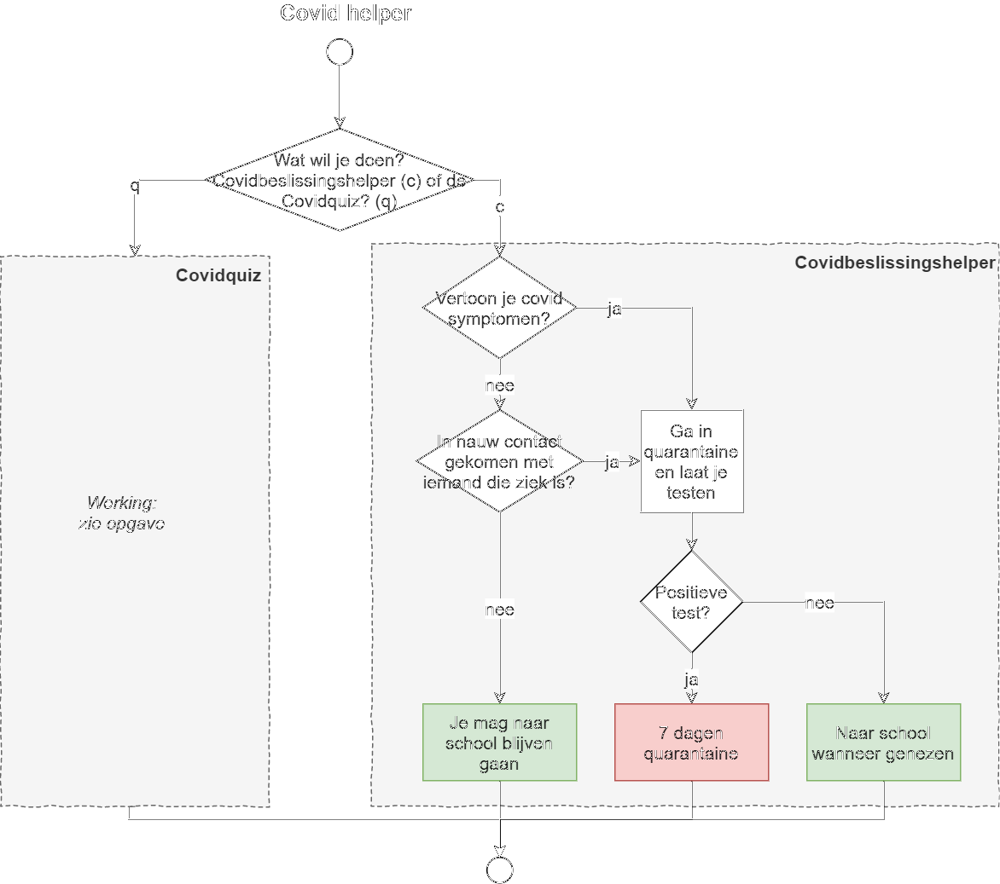

*Geschatte tijd om dit te maken: 60 minuten*

## Introductie
We maken een applicatie die leerlingen kunnen gebruiken om beter te weten wat ze moeten doen in tijden van corona.
De applicatie bestaat uit 2 delen:
* Een “Covidbeslissingshelper”: deze zal enkele vragen aan de leerling vragen om te beslissen of de leerling naar school mag blijven gaan of in quarantaine moet
* Een “Covidquiz”: de leerling zal een vraag over Covid moeten oplossen om te zien of de leerling de regels goed genoeg kent.

*3 punten staan op naamgeving, layout en algemene oplossingsmethode*
## Flowchart (2 punten)
Maak een applicatie volgens volgende flowchart en de uitleg verderop
. 
**Je moet niet controleren of de gebruiker foute invoer geeft. Ga er van uit dat de gebruiker enkel invoer invoert die correct is.**

## Covidbeslissingshelper (4 punten)
Een reeks vragen wordt gesteld, afhankelijk van het vorige antwoord wordt er mogelijk een andere vraag gesteld.

Toon finaal wat de leerling moet doen. Toon dit met tekst wiens achtergrondkleur overeenkomt met die in de flowchart (groen indien naar school mag gegaan worden, rood indien quarantaine)
## Covidquiz (4 punten)
Deze quiz gaat testen of de leerling weet wanneer hij/zij getest moet worden na een risico-contact te hebben gehad. De regel is eenvoudig: bij een contact moet je je na 5 dagen laten testen.

De quiz zal dit testen als volgt:
* De genereert een getal tussen 1 en 5 dagen, inclusief 5. Dit stelt het aantal dagen voor dat de leerling reeds in quarantaine.
* Dit wordt aan de gebruiker getoond.
* Vervolgens wordt gevraagd hoeveel dagen de leerling nog moet wachten voor deze zich moet laten testen.
* De gebruiker voert dit getal is. Indien dit juist is toon je in groene letters “correct”. Bij fout toon je in rode letters “Fout” gevolgd door het juiste antwoord

Voorbeeld:
*Als de computer 3 toont, dan is het juiste antwoord 2. De student moet namelijk op dag 3 nog 2 dagen wachten om op dag 5 getest te worden.*
